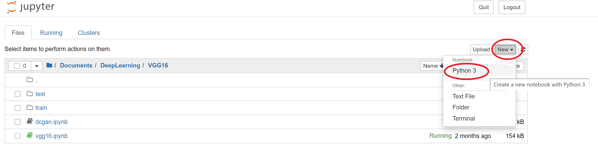

[TOC]

# Course

## Stanford/Coursera

- [Machine Learning](https://www.coursera.org/learn/machine-learning)
- [Deep Learning Specialization](https://www.coursera.org/specializations/deep-learning)

## 3Blue1Brown

- [Neural networks](https://www.youtube.com/watch?v=aircAruvnKk&list=PLZHQObOWTQDNU6R1_67000Dx_ZCJB-3pi)

## Deep Learning

- [Hung-yi Lee: Deep Learning](img/DL-English.pdf)

# Development Environment/Tools

## Anaconda

- [Home Page](https://www.anaconda.com/products/individual)

- General Package Management Environment. It is used to setup basic developement environment with Python/TensorFlow version specified.

- Install Steps

  1. Download and Install Anaconda: [Home Page](https://www.anaconda.com/products/individual)

  2. Open Anaconda Command Line/GUI

     

     

  3. Create New Env

     ```python
     conda create -n MyTensorflow python=3.7
     ```

  4. Activate/Enter Env

     ```
     conda activate MyTensorflow
     
     //Quit Env
     conda deactivate
     ```

## Jupyter

- Interactive Python/Tensorflow Development "IDE"

- Web-based

  

- Install

  ``` 
  conda install jupyter
  ```

## TensorFlow

Install Tensorflow

```
conda install tensorflow-gpu=2.1.0
```

- There are CPU(tensorflow) and GPU(tensorflow-gpu) verison of Tensorflow
- Tensorflow 1.x and 2.x are different
- Use `conda search tensorflow` or `conda search tensorflow-gpu` to list TF version

## Keras

- Higher level API above Tensorflow
- Has more Deep Learning Model/Dataset prepared(i.e: VGG16)

- Tensorflow 2.x has interagted Keras, no need to install it seperately.

- Install(Optional)

  ```
  conda install keras
  ```

## Local vs Cloud

- Local: Anaconda + Jupyter + TensorFlow GPU/Keras
- Cloud: [Google Colab](https://colab.research.google.com/notebooks/intro.ipynb)

## Tips

- Local GPU Memory is not enough

  ```python
  import os
  os.environ["TF_FORCE_GPU_ALLOW_GROWTH"] = "true"
  ```

- Convert to TFLite Error

  Do not install keras, use ternsorflow's `tensorflow.keras`

# Examples

## Keras Startup Example

1. Activate Env: `conda activate MyTensorflow`

2. Startup Jupyter: `jupyter notebook`

3. Create new notebook

   

4. Coding

   

5. Import Tensorflow/Kares

   

6. New Code Block

   

7. Model Print/Save

   ```python
   from tensorflow.keras.utils import plot_model
   model.summary()
   plot_model(model, to_file='vgg16.png', show_shapes=True)
   ```

   

## VGG Model


- Build-in Loss: https://keras.io/api/losses/
- Build-in Optimizers: https://keras.io/api/optimizers/
- Build-in Model: https://keras.io/api/applications/
- Build-in Dataset: https://keras.io/api/datasets/

## VGG16 Implementation


- Sequential Mode: Input->Network->Output

- 画像分類（Classification）問題：Input（224x224 RGB 画像）->Network->Output（種類：Cat・Dog・Brid…）

- Implementation Details 実装の詳細

  - Code: DeepLearning/code/vgg/vgg16.ipynb

  - Convolution

    Kernel Size: 3x3

    $\begin{bmatrix}1&0&1\\0&1&0\\1&0&1\end{bmatrix}$

    

    

  - Max pooling

    - filter 2x2
    - stride 2x2
    - **Max** value in filter

    

  - Code<->Graph

    

  - Training:

    - Keras has well-trained vgg mode

    - If custom training data prepared.自分のDatasetがある場合は

    - Dog/Cat Dataset as an example to explain training process

      - Download Dog/Cat Dataset: [Kaggle Cats and Dogs Dataset](https://www.microsoft.com/en-us/download/details.aspx?id=54765)

      - Pick some(most of) images as Training Data;

      - Pick rest of images as Testing Data;

      - Folder struct is as follow:

        

      - Loading data

        ```python
        size = (224,224)
        traind = ImageDataGenerator().flow_from_directory(directory="train", target_size=size)
        testd = ImageDataGenerator().flow_from_directory(directory="test", target_size=size)
        ```

      - Training

        ```python
        hist = model.fit_generator(
            steps_per_epoch=100,
            generator=traind,
            validation_data=testd,
            validation_steps=10,
            epochs=100)
        ```

      - To display Training graph

        ```python
        plt.plot(hist.history["accuracy"])
        plt.plot(hist.history['val_accuracy'])
        plt.plot(hist.history['loss'])
        plt.plot(hist.history['val_loss'])
        plt.title("model accuracy")
        plt.ylabel("Accuracy")
        plt.xlabel("Epoch")
        plt.legend(["Accuracy","Validation Accuracy","loss","Validation Loss"])
        plt.show()
        ```

        

      - Save/Load Model

        ```python
        model.save('vgg16_trained.h5')
        
        from keras.models import load_model
        saved_model = load_model("vgg16_trained.h5")
        ```

      - Prediction

        ```python
        from keras.preprocessing import image
        import numpy as np 
        img = image.load_img("test5.jpeg",target_size=(224,224))
        img = np.asarray(img)
        plt.imshow(img)
        img = np.expand_dims(img, axis=0)
        output = model.predict(img)
        if output[0][0] > output[0][1]:
            print("cat")
        else:
            print('dog')
        
        print('{:.2}'.format(output[0][0]))
        print('{:.2}'.format(output[0][1]))
        ```

        

        

- Reference:

  - https://www.cc.gatech.edu/~san37/post/dlhc-cnn/
  - https://developers.google.com/machine-learning/practica/image-classification/convolutional-neural-networks?hl=id

## GAN

## Pix2Pix

## TL/Keras Official Examples

## Unity

- TLLite
- Unity Example

