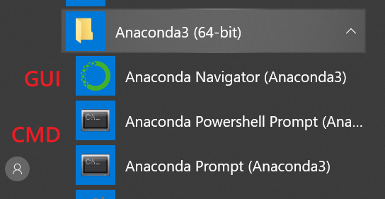
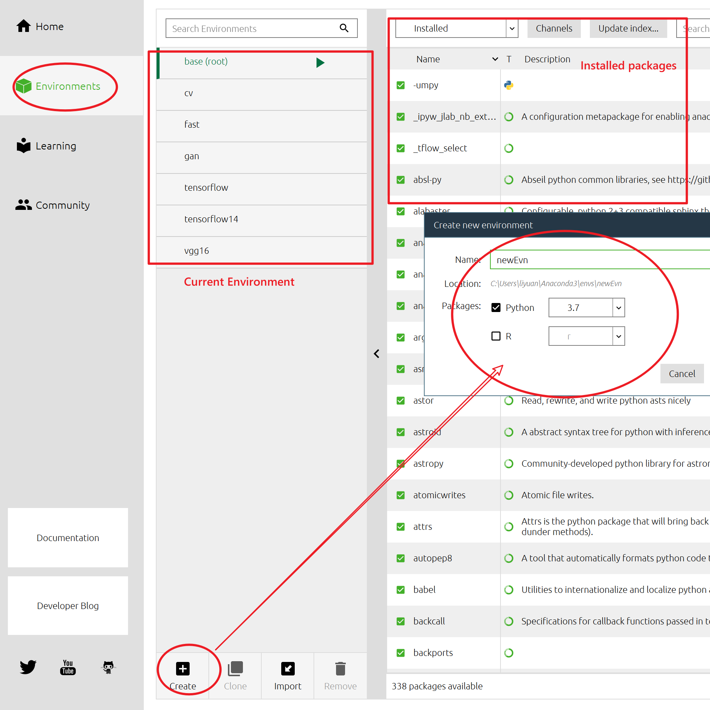
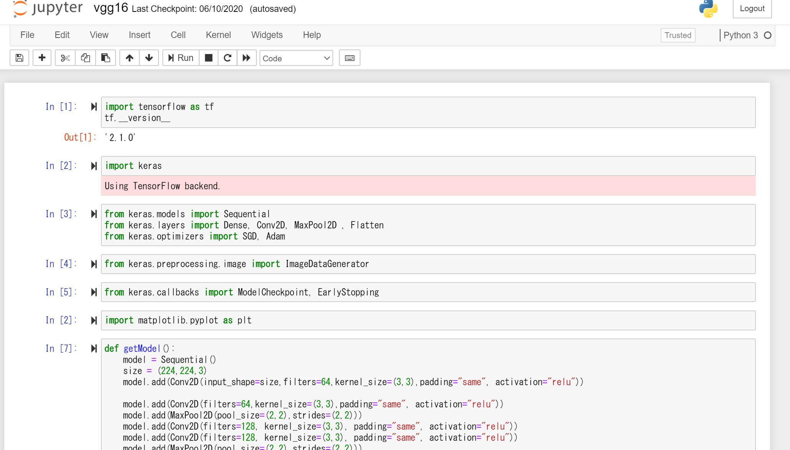
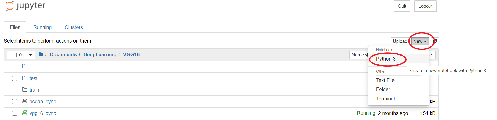
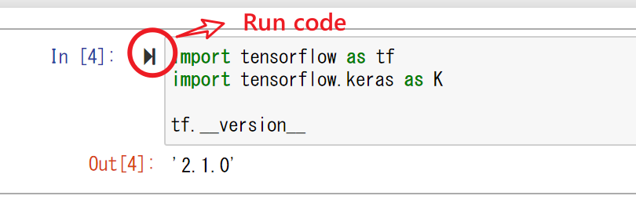
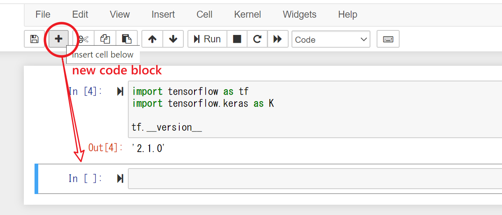
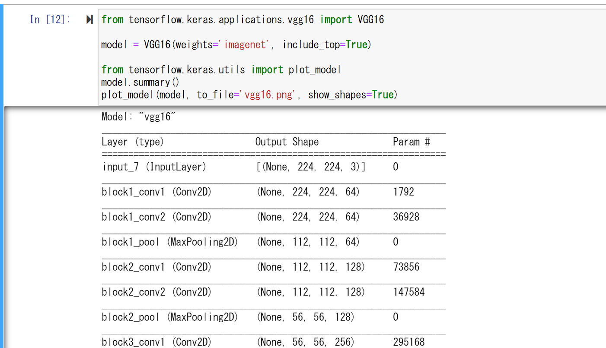
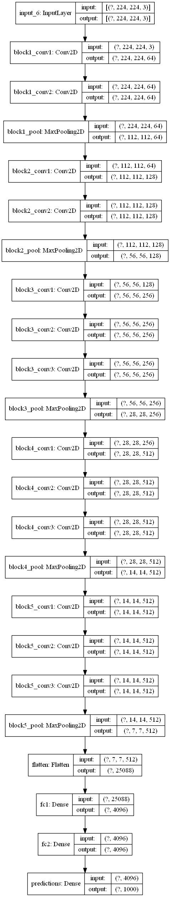

# Development Environment/Tools

## Anaconda

- [Home Page](https://www.anaconda.com/products/individual)

- General Package Management Environment. It is used to setup basic developement environment with Python/TensorFlow version specified.

- Install Steps

  1. Download and Install Anaconda: [Home Page](https://www.anaconda.com/products/individual)

  2. Open Anaconda Command Line/GUI

     

     

  3. Create New Env

     ```python
     conda create -n MyTensorflow python=3.7
     ```

  4. Activate/Enter Env

     ```
     conda activate MyTensorflow
     
     //Quit Env
     conda deactivate
     ```

## Jupyter

- Interactive Python/Tensorflow Development "IDE"

- Web-based

  

- Install

  ``` 
  conda install jupyter
  ```

## TensorFlow

Install Tensorflow

```
conda install tensorflow-gpu=2.1.0
```

- There are CPU(tensorflow) and GPU(tensorflow-gpu) verison of Tensorflow
- Tensorflow 1.x and 2.x are different
- Use `conda search tensorflow` or `conda search tensorflow-gpu` to list TF version

## Keras

- Higher level API above Tensorflow

- Has more Deep Learning Model/Dataset prepared(i.e: VGG16)

- Tensorflow 2.x has interagted Keras, no need to install it seperately.

- Install(Optional)

  ```
  conda install keras
  ```

## Local vs Cloud

- Local: Anaconda + Jupyter + TensorFlow GPU/Keras
- Cloud: [Google Colab](https://colab.research.google.com/notebooks/intro.ipynb)

## Tips

- Local GPU Memory is not enough

  ```python
  import os
  os.environ["TF_FORCE_GPU_ALLOW_GROWTH"] = "true"
  ```

- Convert to TFLite Error

  Do not install keras, use ternsorflow's `tensorflow.keras`

# Examples

## Keras Startup Example

1. Activate Env: `conda activate MyTensorflow`

2. Startup Jupyter: `jupyter notebook`

3. Create new notebook

   

4. Coding

   

5. Import Tensorflow/Kares

   

6. New Code Block

   

7. Model Print/Save

   ```python
   from tensorflow.keras.utils import plot_model
   model.summary()
   plot_model(model, to_file='vgg16.png', show_shapes=True)
   ```

   

## 



- Build-in Loss: https://keras.io/api/losses/
- Build-in Optimizers: https://keras.io/api/optimizers/
- Build-in Model: https://keras.io/api/applications/
- Build-in Dataset: https://keras.io/api/datasets/