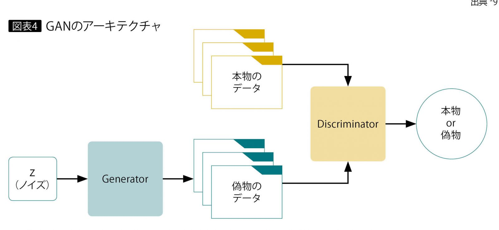
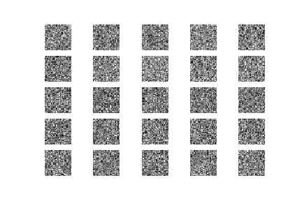
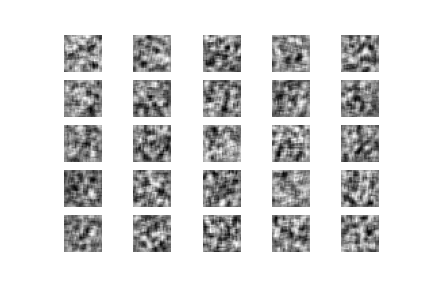

# GAN

## Introduction

- GAN: Generative Adversarial Network
- 目標：ノイズ（Noise）から（Generatorで）（本物ような）画像を生成する
- 色々な種類がある: GAN, DCGAN, CGAN, Pix2Pix.....
- 

## GAN with simple MLP

- Code: gan/gan.ipynb

- MLP: Multilayer Perceptron=>KerasのDense Layer

  

- 一番簡単なGAN

- Generator

  ```python
  def GANGenerator():
      model = Sequential()
      
      inputDim = 100
      outputDim = (28,28,1)
      
      model.add(Dense(256, input_dim=inputDim))
      model.add(LeakyReLU(alpha=0.2))
      model.add(BatchNormalization(momentum=0.8))
      
      model.add(Dense(512))
      model.add(LeakyReLU(alpha=0.2))
      model.add(BatchNormalization(momentum=0.8))
          
      model.add(Dense(1024))
      model.add(LeakyReLU(alpha=0.2))
      model.add(BatchNormalization(momentum=0.8))
      
      model.add(Dense(np.prod(outputDim), activation='tanh'))    
      model.add(Reshape(outputDim))
      
      #model.summary()    
      return model
  ```

- Discriminator

  ```python
  def GANDiscriminator():
      model = Sequential()
          
      imgDim = (28,28,1)
      
      model.add(Flatten(input_shape=imgDim))
      model.add(Dense(512))
      model.add(LeakyReLU(alpha=0.2))
      
      model.add(Dense(256))
      model.add(LeakyReLU(alpha=0.2))
      
      model.add(Dense(1, activation='sigmoid'))    
      
      #model.summary()
      
      return model
  ```

- GAN=Generator+Discriminator

  ```python
  def GANcombined(G,D):#G is Generator; D is Discriminator
      model = Sequential()
      
      model.add(G)
      
      D.trainable = False
      model.add(D)
      
      #model.summary()
      
      return model
  ```

  ```python
  ad = Adam(0.0002, 0.5)
  
  gen = GANGenerator()
  #optional compile
  #gen.compile(optimizer=ad, loss='binary_crossentropy', metrics=['accuracy'])
  
  dis = GANDiscriminator();
  dis.compile(optimizer=ad, loss='binary_crossentropy', metrics=['accuracy'])
  
  combined = GANcombined(gen, dis)
  combined.compile(optimizer=ad, loss='binary_crossentropy', metrics=['accuracy'])
  ```

- Training/学習（mnist Datasetを使って）

  1. Discriminatorの学習
  2. （GeneratorはGANに入っているので）GANの学習

  ```python
  (X_train, y_train), (X_test, y_test) = mnist.load_data()
  
  valid = np.ones((batch_size, 1))
  fake = np.zeros((batch_size, 1))
  
  for epoch in range(30000):   
      # Select a random batch of images
      idx = np.random.randint(0, X_train.shape[0], batch_size)
      imgs = X_train[idx]
  
      noise = np.random.normal(0, 1, (batch_size, inputDim))
      # Generate a batch of new images
      gen_imgs = gen.predict(noise)
  
      # Train the discriminator
      # 1. Discriminatorの学習
      # mnist dataは本物
      d_loss_real = dis.train_on_batch(imgs, valid)
      # Generaotrのdataは偽物
      d_loss_fake = dis.train_on_batch(gen_imgs, fake)        
  
      # Train GAN
      # 2. GANの学習
      noise = np.random.normal(0, 1, (batch_size, inputDim))
      # Train the generator (to have the discriminator label samples as valid)
      # 目標はノイズ（Noise）から本物になる
      g_loss = combined.train_on_batch(noise, valid)
  ```

  
  

##DCGAN 

- Code: gan/dcgan.ipynb

- DCGAN = GAN+DC(Deep Convolutional)

- 他の部分が同じですので、DiscriminatorとGeneratorにDCを導入する

- Generator

  ```python
  def GANGenerator():
      inputDim = 100
      outputDim = (28,28,1)
      
      model = Sequential()
      model.add(Input(shape=inputDim), )
      model.add(Dense(1024))
      model.add(Activation('tanh'))
  
      model.add(Dense(128*7*7))
      model.add(BatchNormalization())
      model.add(Activation('tanh'))
  
      model.add(Reshape((7, 7, 128)))
  
      model.add(Conv2DTranspose(64, kernel_size=(5, 5), strides=(2, 2), padding='same'))
      model.add(Activation('tanh'))
  
      model.add(Conv2DTranspose(1, kernel_size=(5, 5), strides=(2, 2), padding='same'))
      model.add(Activation('tanh'))
      assert model.output_shape == (None, 28, 28, 1)
  
      #model.summary()
  
      return model
  ```

- Discriminator

  ```python
  def GANDiscriminator():
      model = Sequential()
          
      imgDim = (28,28,1)
      
      model.add(Input(shape=imgDim), )
      model.add(Conv2D(64, (5, 5),padding='same',))
      model.add(Activation('tanh'))
      model.add(MaxPooling2D(pool_size=(2, 2)))
      
      model.add(Conv2D(128, (5, 5)))
      model.add(Activation('tanh'))
      model.add(MaxPooling2D(pool_size=(2, 2)))
      
      model.add(Flatten())
      model.add(Dense(1024))
      model.add(Activation('tanh'))
      
      model.add(Dense(1))
      model.add(Activation('sigmoid')) 
      
      #model.summary()
      
      return model
  ```

  

## Reference

- [GAN：敵対的生成ネットワークとは何か　～「教師なし学習」による画像生成](https://www.imagazine.co.jp/gan%EF%BC%9A%E6%95%B5%E5%AF%BE%E7%9A%84%E7%94%9F%E6%88%90%E3%83%8D%E3%83%83%E3%83%88%E3%83%AF%E3%83%BC%E3%82%AF%E3%81%A8%E3%81%AF%E4%BD%95%E3%81%8B%E3%80%80%EF%BD%9E%E3%80%8C%E6%95%99%E5%B8%AB/)

